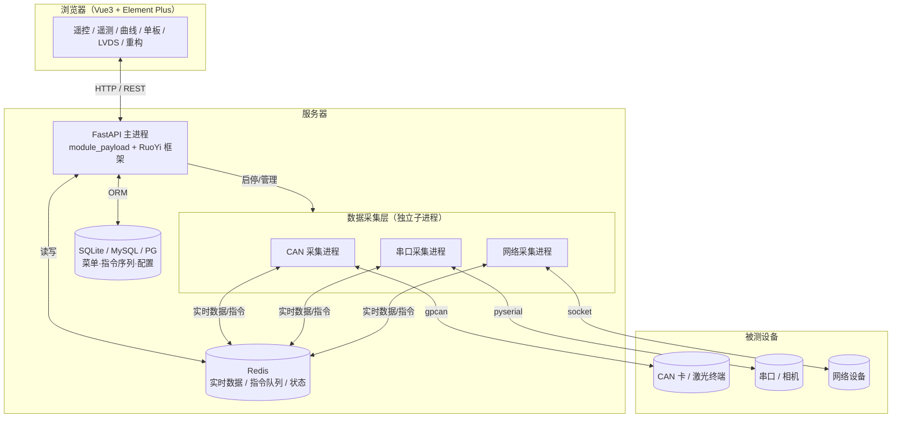
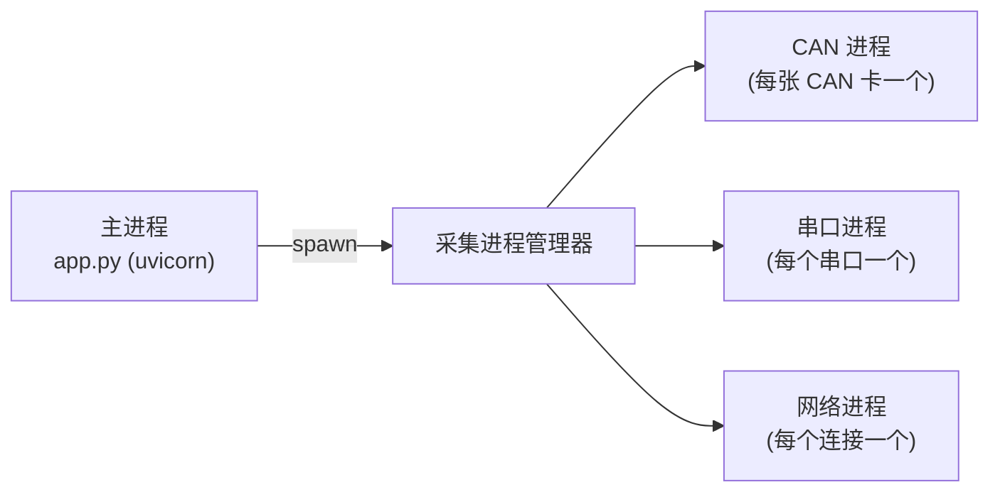
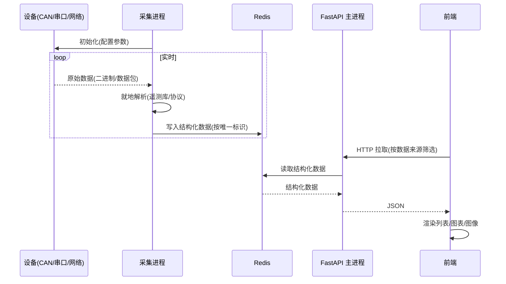
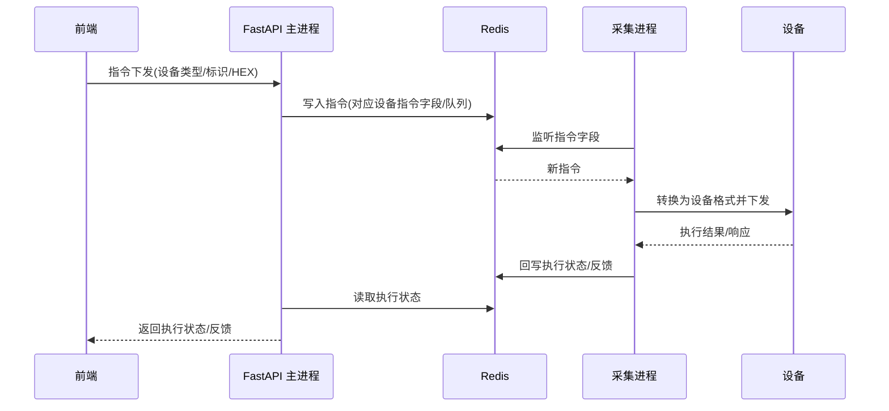

# 01 - 系统总体设计

## 1. 设计目标

通过浏览器端可视化界面，实现对卫星激光终端的：

- **实时数据监控**：CAN 遥测、工程遥测（LVDS/高速）、串口图像等多源数据实时展示；
- **指令控制**：遥控指令下发、控制开关操作、指令序列批量执行；
- **图表分析**：遥测量曲线、工程遥测高速波形（类示波器）；
- **图像状态展示**：相机串口图像采集与显示。

后端采用 **多进程架构**，把「设备采集」与「API 服务」解耦，保证采集稳定性不受 Web 请求波动影响。

---

## 2. 总体架构



### 分层职责

| 层             | 角色                | 关键职责                                                                 |
| -------------- | ------------------- | ------------------------------------------------------------------------ |
| 前端展示层     | Vue3 SPA            | 菜单路由、表单、表格、ECharts 图表、指令面板                              |
| API 服务层     | FastAPI 主进程      | 鉴权、菜单、CRUD、把前端请求翻译为 Redis 读写、采集进程生命周期管理       |
| 进程间通信     | Redis               | 采集进程与主进程之间的实时数据、指令、状态、心跳交换                      |
| 数据采集层     | CAN/串口/网络子进程 | 设备初始化、原始数据读取、**就地解析**、指令执行、断线重连               |
| 持久化层       | SQLite/MySQL/PG     | 系统菜单、指令序列、（可选）遥测历史                                     |

> **为什么用 Redis 而非进程内队列**：采集进程是独立操作系统进程（非线程），与 FastAPI
> 进程不共享内存；Redis 提供了进程间共享的数据总线，并天然支持多 worker 部署。

---

## 3. 进程模型

### 3.1 进程划分



- 主进程：FastAPI 服务 + 采集进程管理器（负责启停、监控、回收子进程）。
- 采集子进程：使用 Python `multiprocessing`（或 `subprocess` 启动独立脚本），
  每类设备一套采集逻辑，独立崩溃不影响其它设备与 API。

### 3.2 进程粒度与生命周期（关键规则）

> 详见 [02-数据采集层设计](./02-数据采集层设计.md)。

- **CAN 卡（进程级共享）**：`--vendor`、`--dev-index` 相同、`--can-index` 不同表示
  **同一张 CAN 卡的不同通道**。同一张卡的所有通道**共用同一个进程**；只有当该卡上
  所有通道都关闭后，才能关闭对应进程。
  - 通过 `CanClient.get_opened_channel_list()` 获取某厂家驱动下已打开的通道列表辅助管理。
- **串口 / UDP（按需启停）**：打开即开启进程，关闭即关闭进程。
- **唯一标识**：从 Redis 取数时需要设备唯一标识（见 [02 章 Redis Key 设计](./02-数据采集层设计.md)）。

---

## 4. 数据流

### 4.1 采集 → 前端展示



### 4.2 前端指令 → 设备执行



---

## 5. 技术选型

| 维度       | 选型                                          | 说明                                            |
| ---------- | --------------------------------------------- | ----------------------------------------------- |
| 后端框架   | FastAPI（RuoYi-FastAPI 脚手架）               | 异步、自动路由注册、分层（controller/service/dao） |
| ORM        | SQLAlchemy（async）                           | DO 模型继承 `config.database.Base`              |
| 数据库     | SQLite（默认，文件 `ruoyi-fastapi.db`）        | 同时维护 MySQL / PG 三套 SQL                     |
| 缓存/总线  | Redis 7.x（`redis==7.1.0` 已在依赖）          | 实时数据、指令队列、采集状态                     |
| 前端框架   | Vue 3.5 + Vite 6 + Element Plus               | 动态路由由后端 `sys_menu` 驱动                   |
| 图表       | ECharts 5.6（已在依赖）                       | 遥测曲线、工程遥测波形                           |
| 进程       | `multiprocessing` / 独立脚本进程              | 采集进程与主进程解耦                             |
| CAN        | `gpcan`                                       | 见 `test/pygpcan`                               |
| 遥测解析   | `telemetryparser`                            | 见 `test/TeleMetry`                             |
| 串口       | `pyserial`                                    | 相机图像采集（见 `test/showimg`）               |

> **依赖补充**：后端当前 `requirements.txt` 未包含 `pyserial`、`gpcan`、`telemetryparser`，
> 实现阶段需补充（`whl/` 内为本地 wheel，可离线安装）。

---

## 6. 新增代码目录规划

### 6.1 后端（`ruoyi-fastapi-backend`）

```
module_payload/                 # 新增业务模块（载荷地检）
├── controller/                 # 路由层
│   ├── device_controller.py        # 设备连接/通道管理（CAN/串口/网络 打开关闭、状态）
│   ├── telecontrol_controller.py   # 遥控配置读取、单指令下发、控制开关操作
│   ├── telemetry_controller.py     # 遥测表/遥测量查询、曲线数据
│   ├── sequence_controller.py      # 指令序列 CRUD + 执行
│   └── camera_controller.py        # 相机图像采集
├── service/                    # 业务逻辑层
├── dao/                        # 数据访问层
├── entity/
│   ├── do/                     # SQLAlchemy 模型（指令序列等）
│   └── vo/                     # Pydantic 入出参
├── collectors/                 # 采集进程实现（独立运行）
│   ├── base_collector.py
│   ├── can_collector.py
│   ├── serial_collector.py
│   ├── net_collector.py
│   └── process_manager.py      # 采集进程生命周期管理
├── redis_keys.py               # Redis Key 命名规范（集中定义）
└── cfg/                        # 配置加载（TeleControlCfg / TeleMetryCfg 解析）
```

> 控制器变量需命名为 `*_controller` 并使用 `APIRouterPro`，框架会自动发现并注册（无需手动登记）。

### 6.2 前端（`ruoyi-fastapi-frontend/src`）

```
api/payload/                    # 与后端对应的 axios 封装
views/payload/
├── telecontrol/                # 遥控目录
│   ├── control/index.vue           # 控制开关
│   ├── command/index.vue           # 遥控（树形 + 单条指令）
│   └── sequence/index.vue          # 指令序列
├── telemetry/
│   ├── table/index.vue             # 遥测表单（按数据类型复用，参数化）
│   └── curve/index.vue             # 遥测曲线
├── board/
│   └── camera/index.vue            # 相机测试
├── lvds/
│   └── engineering/index.vue       # 工程遥测（高速波形）
└── refactor/index.vue              # 重构（暂空白页）
```

---

## 7. 关键设计决策与假设

| 编号 | 决策 / 假设                                                                                  |
| ---- | ------------------------------------------------------------------------------------------- |
| D1   | 采集进程「就地解析」：原始字节在子进程内解析为结构化数据后写 Redis，主进程不做重解析。       |
| D2   | 遥测实时值用 Redis 存「最新值」；遥测曲线所需的时间序列另用 Redis 结构存储（见 02 章）。     |
| D3   | 新增后端业务模块统一命名 `module_payload`。                                                  |
| D4   | 新增菜单 `menu_id` 使用 2000+ 区段（现库最大 1064），避免与框架既有菜单冲突。                |
| D5   | 「重构」菜单当前仅占位空白页，后续按需补充。                                                 |
| D6   | 时间相关指令（如时间广播）涉及 UTC/北京时间换算，沿用 C++ 端「+8 小时」处理（**待确认**）。  |

> 以上决策可在评审后调整，相关细节在对应专题文档展开。
