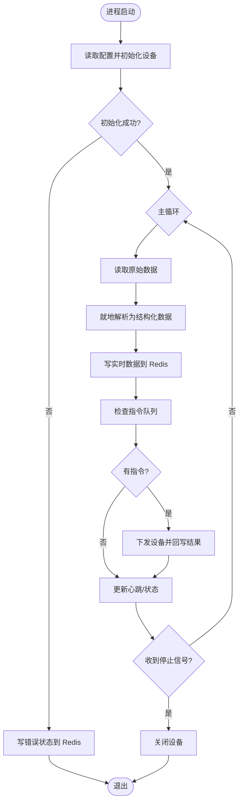
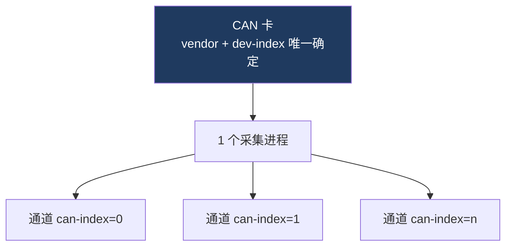
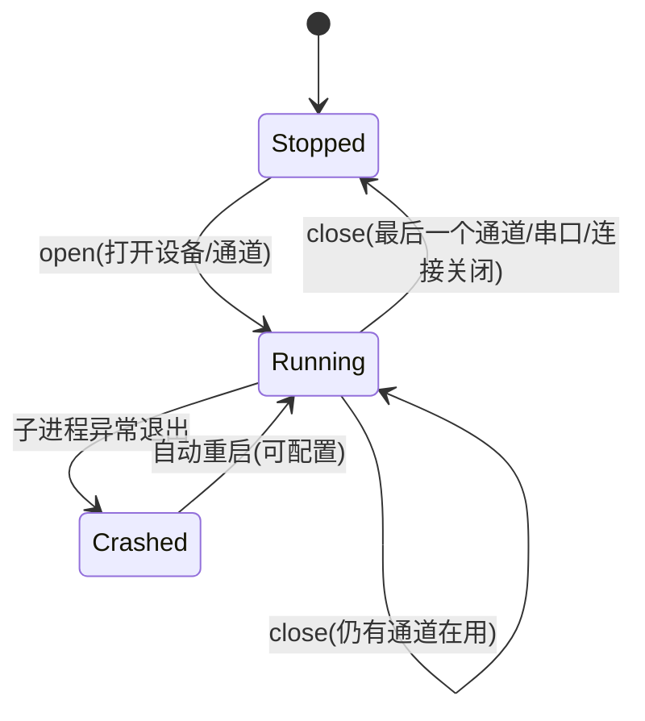
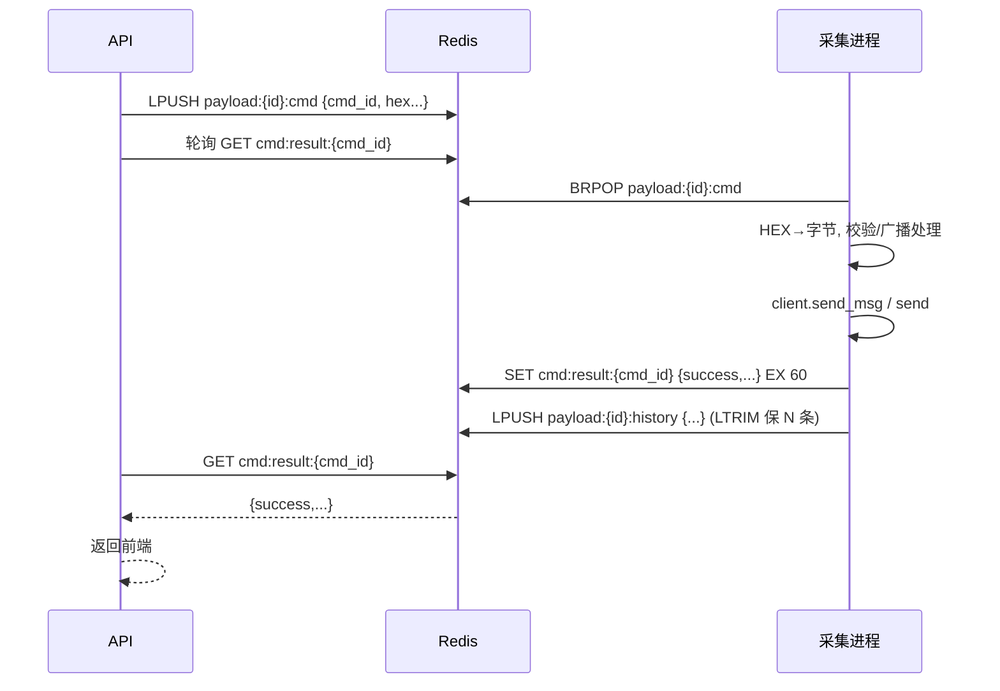

# 02 - 数据采集层设计

数据采集层独立于 API 服务，专门负责对应类型设备的数据采集与指令执行，避免采集异常
影响整体系统，并支持多类型设备灵活扩展。

---

## 1. 采集进程总览

| 进程       | 设备       | 依赖库         | 进程粒度                       | 启停策略                       |
| ---------- | ---------- | -------------- | ------------------------------ | ------------------------------ |
| CAN 采集   | CAN 卡     | `gpcan`        | **每张 CAN 卡一个进程**        | 卡上所有通道关闭后才关进程     |
| 串口采集   | 串口/相机  | `pyserial`     | 每个串口一个进程               | 打开开进程，关闭关进程         |
| 网络采集   | TCP/UDP    | `socket`       | 每个连接一个进程               | 打开开进程，关闭关进程         |

所有采集进程遵循统一骨架：**初始化 → 循环读取 → 就地解析 → 写 Redis → 监听并执行指令 → 心跳/状态上报**。



---

## 2. 进程 1：CAN 采集进程

### 2.1 CAN 库（gpcan）核心 API

> 源码参考 `test/pygpcan`，打包库 `whl/gpcan-1.0.0-py3-none-any.whl`。

```python
from gpcan import (
    CanClient, CanCardParam, CanMsgParam, CanSendParam, CanMsgReq,
    CanVendorType, CanRetCode, AssembleType, create_assemble,
)

client = CanClient(
    vendor,                       # CanVendorType: 0 DEMO / 1 USB_V502 / 2 USB_ALYST_PRO / 3 ZLG
    CanCardParam(
        n_can_index=0,            # 通道号 0:CAN1 1:CAN2 2:CAN3 3:CAN4
        n_baud_rate=500,          # Kbps：125/250/500/1000
        n_dev_type=-1,            # <0 用厂家默认
        n_dev_index=0,            # CAN 卡序号（多卡时区分）
        n_can_timeout_read_ms=10,
        n_can_send_sleep_ms=-1,
    ),
    CanMsgParam(n_can_node_type=0, n_node_addr_to=0x0D, n_cable_flag=0),  # 上位机=主，目标=激光终端B，A线
    CanSendParam(un_send_type=0, un_remote_flag=0, un_extern_flag=0),
    create_assemble(AssembleType.COMPLEX),  # 复合帧组装器(可选)
)

client.init_can(); client.open_can()
for obj in client.recv_msg(64):       # 业务层接收(自动组装复合帧)
    ...                               # obj.un_id / obj.str_data / obj.n_can_index / obj.n_frame_flag
client.send_msg(CanMsgReq(data, is_broadcast=False))  # 业务层发送(自动生成ID/分帧)
client.send(can_id, data, len, ...)   # SDK层发送(直接给ID与数据)
client.get_opened_channel_list()      # 当前厂家驱动下已打开通道列表(n_dev_index)
client.close_can(); client.deinit_can()
```

枚举要点（`gpcan.can_def`）：

- `CanVendorType`：`DEMO=0`、`USB_V502=1`、`USB_ALYST_PRO=2`、`ZLG=3`。
- `CanNodeAddr`：`MASTER=0x00`、`LASER_A=0x0C`、`LASER_B=0x0D`。
- `CanRetCode`：`OK=1`、`ERR=0`。
- `CanFrameFlag`（ID 低 2 位）：单帧 0、起始 1、中间 2、尾帧 3。

### 2.2 进程粒度（核心约束）



- 同一张卡（`vendor`、`dev-index` 相同，`can-index` 不同）的多个通道，**复用同一个进程**。
- 关闭某通道：仅停止该通道的收发；**当卡上所有通道都关闭后**，才关闭进程并 `close_can/deinit_can`。
- 进程内为每个已开通道维护一个 `CanClient` 实例（或单实例多通道，依库能力，**待确认**）。

### 2.3 CAN 进程职责

1. 按通道配置初始化 `CanClient`，逐通道 `open_can`；
2. 轮询 `recv_msg()` 收取遥测帧；
3. **就地解析**：取帧内「数据类型字节」（见 [07 章](./07-遥控帧组装与遥测解析规则.md)），调用 `telemetryparser`
   解析为字段行，写入 Redis 实时值与**全字段**曲线时间序列；
4. 监听指令队列：取出 HEX 指令 → `send_msg`/`send`，回写执行结果；
5. 周期上报心跳与统计（收发计数、误码率等）。

---

## 3. 进程 2：串口采集进程

> 协议与重组逻辑参考 `test/showimg/serial_image_viewer.py`、`test/GeniusProsSoftPlatform` 下 rs422/serial 文件。

- **初始化**：端口号、波特率（相机示例为 `2_000_000`）、数据位 8、校验位（相机为奇校验 ODD）、停止位 1、超时。
- **相机图像协议**（见 [07 章](./07-遥控帧组装与遥测解析规则.md) 复述）：
  - 帧头 `EB 90`，请求帧 10 字节，应答帧 266 字节（256 字节图像分片 + 校验）；
  - 首帧/中间帧/尾帧拼接成整图，分辨率可选 400/256/128/64；
  - 单帧失败重试 5 次，超限整图重采。
- **写 Redis**：将整帧图像（或分片进度）写入 Redis（建议存 PNG/灰度字节 + 元数据），前端拉取展示。
- **指令**：接收后端下发的串口指令（HEX），写串口并回执。

---

## 4. 进程 3：网络采集进程

- **配置**：IP、端口、协议（TCP/UDP）。
- **连接**：建立连接，TCP 支持断线自动重连；UDP 收发数据报。
- **接收**：实时收包 → 就地解析（按自定义协议）→ 写 Redis。
- **指令**：监听 Redis 指令字段 → 通过 TCP/UDP 发送 → 回写结果。
- **多设备并行**：每个连接实例一个进程，互不影响。

---

## 5. 进程管理

由主进程内的「采集进程管理器」`process_manager.py` 负责：



管理器职责：

- **注册表**：以「设备唯一标识」为键，登记进程句柄、已开通道、状态、心跳时间。
- **启动**：
  - CAN：若该卡进程已存在→向其追加通道；否则创建新进程。
  - 串口/网络：直接创建/销毁对应进程。
- **关闭**：CAN 需「引用计数」式关闭（所有通道关闭后回收进程）。
- **健康检查**：基于 Redis 心跳判断进程存活，必要时重启并记录日志。
- **优雅退出**：主进程关闭时统一发送停止信号、回收所有子进程。

### 设备唯一标识（device_id）约定

| 设备类型 | 唯一标识格式                          | 示例                  |
| -------- | ------------------------------------- | --------------------- |
| CAN 卡   | `can:{vendor}:{dev_index}`            | `can:0:0`             |
| CAN 通道 | `can:{vendor}:{dev_index}:{can_index}`| `can:0:0:0`（含厂商，不含线缆） |
| 串口     | `serial:{port}`                       | `serial:COM3`         |
| 网络     | `net:{proto}:{ip}:{port}`             | `net:tcp:192.168.1.10:8000` |

---

## 6. Redis IPC 协议设计

> 所有 Key 统一前缀 `payload:`，集中定义于 `module_payload/redis_keys.py`。
> 下表 `{id}` 表示上文「设备唯一标识」。

### 6.1 Key 一览

| 用途         | Key 模式                                   | 类型        | 写入方   | 读取方   | 说明                                  |
| ------------ | ------------------------------------------ | ----------- | -------- | -------- | ------------------------------------- |
| 通道/设备状态 | `payload:{id}:status`                       | String(JSON)| 采集进程 | 主进程   | 连接状态、错误信息、统计              |
| 进程心跳     | `payload:{id}:heartbeat`                     | String(ts)  | 采集进程 | 管理器   | 设 TTL，过期视为失联                  |
| 遥测最新值   | `payload:{id}:tm:{type}`                     | Hash/String | 采集进程 | 主进程   | 某遥测表(type=FF…)最新一帧解析结果    |
| 遥测帧时间戳 | `payload:{id}:tm:{type}:ts`                  | String      | 采集进程 | 主进程   | 最近更新时间                          |
| 曲线时间序列 | `payload:{id}:curve:{type}:{field}`          | Stream/ZSet | 采集进程 | 主进程   | 遥测量历史（曲线用），带容量上限      |
| 指令下发队列 | `payload:{id}:cmd`                           | List        | 主进程   | 采集进程 | `LPUSH` 入队，采集进程 `BRPOP` 取出   |
| 指令执行结果 | `payload:{id}:cmd:result:{cmd_id}`           | String(JSON)| 采集进程 | 主进程   | 单条指令执行回执，设 TTL              |
| 发送历史     | `payload:{id}:history`                       | List        | 采集进程 | 主进程   | 最近 N 条发送记录（前端「发送历史」） |
| 串口图像     | `payload:{id}:image`                         | String(bin) | 采集进程 | 主进程   | 最新整帧图像 + 元数据                 |
| 工程遥测波形 | `payload:{id}:lvds:{signal}`                 | Stream      | 采集进程 | 主进程   | 高速信号点序列（限频/限量）           |

### 6.2 数据结构示例

**遥测最新值** `payload:tm:FF:latest`（JSON，帧内含 `srcParam=can:0:0:0`）：

```json
{
  "type": "FF",
  "name": "B-1主要包",
  "ts": "2026-06-22 17:00:00.123",
  "fields": [
    { "id": "JGB001", "name": "遥测请求指令计数", "value": 2, "show": "2", "hex": "02", "unit": "" },
    { "id": "JGB103", "name": "终端模式", "value": 0, "show": "待机模式", "hex": "00", "unit": "" }
  ]
}
```

**指令下发** `LPUSH payload:can:0:0:0:cmd`（JSON）：

```json
{
  "cmd_id": "uuid-xxxx",
  "hex": "0A 91 00 04 00 04 AA AA",
  "broadcast": false,
  "all_channel": false,
  "append_checksum": false,
  "ts": "2026-06-22 17:00:00"
}
```

**指令执行结果** `payload:can:0:0:0:cmd:result:uuid-xxxx`（JSON）：

```json
{ "cmd_id": "uuid-xxxx", "success": true, "message": "OK", "ts": "2026-06-22 17:00:00.456" }
```

### 6.3 指令收发时序



> **曲线时间序列**：采集进程对每个可数值化遥测量写入 ZSet（score=时间戳，member=`ts|val`），
> 并按 `CURVE_MAX_POINTS` 裁剪；与前端是否显示曲线无关。
> 详见 [09 遥测 Redis 与显示流程](./09-遥测Redis存储与前后端显示流程.md)、[05 章 遥测曲线](./05-前端页面设计.md) 与 [04 章接口](./04-后端接口设计.md)。

---

## 7. 数据解析（就地解析）

「不同方式获取的数据，内容的解析放在子进程」——避免主进程被 CPU 密集型解析拖慢。

| 数据源     | 解析方式                                                                 |
| ---------- | ------------------------------------------------------------------------ |
| CAN 遥测   | `telemetryparser`：按数据类型字节取表 → `parse_hex(key, payload)` → 字段行 |
| 工程遥测   | 高速类型 `7E9B/7E9D/7E9F`，按工程遥测协议解析为信号点（**协议待确认**）   |
| 串口图像   | 按 `EB 90` 帧协议重组整图（见 07 章）                                     |
| 网络数据   | 按自定义协议解析（**协议待确认**）                                        |

`telemetryparser` 用法（参考 `test/TeleMetry/TeleMetryCmd.py`）：

```python
from TeleMetryParser import TeleMetryCfgManager
mgr = TeleMetryCfgManager.instance()
mgr.init(cfg_path)                      # 加载 TeleMetryCfg.json
key = f"{frame[3]:02X}"                 # 第 3 字节为数据类型
lines = mgr.parse_hex(key, payload_hex) # 解析为字段行(.id/.name/.show/.hex/.err)
```

---

## 8. 异常与可靠性

| 场景             | 处理策略                                                       |
| ---------------- | ------------------------------------------------------------- |
| 设备初始化失败   | 写错误状态到 `:status`，进程退出，管理器据策略重试            |
| 网络断开         | TCP 自动重连（指数退避），期间状态置「重连中」                |
| 采集进程崩溃     | 心跳过期 → 管理器检测 → 重启（可配置最大重试次数）            |
| 指令下发失败     | 回写 `success=false` + 错误信息，前端「发送历史」标红        |
| 主进程退出       | 统一停止信号 → 子进程优雅关闭设备 → 回收                      |
