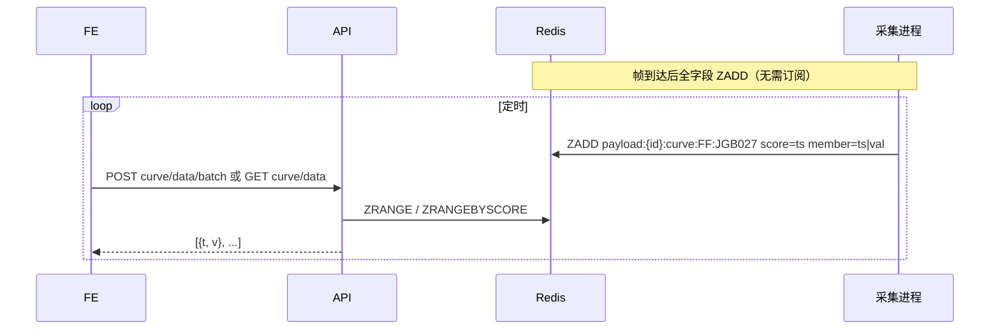

# 04 - 后端接口设计

新增业务模块 `module_payload`，遵循 RuoYi-FastAPI 分层规范
（`controller → service → dao → entity(do/vo)`），路由用 `APIRouterPro` 自动注册。

- 统一前缀：`/payload`
- 统一鉴权：路由级 `PreAuthDependency()`（登录态）；按钮级权限用 `UserInterfaceAuthDependency('payload:xxx:yyy')`
- 统一返回：`ResponseUtil.success(...)`，分页 `PageResponseModel[T]`

---

## 1. 控制器划分

| 控制器                     | 前缀                    | 职责                                       |
| -------------------------- | ----------------------- | ------------------------------------------ |
| `device_controller`        | `/payload/device`       | CAN/串口/网络的连接管理、通道列表、状态     |
| `telecontrol_controller`   | `/payload/telecontrol`  | 遥控配置读取、单条指令下发、控制开关操作    |
| `telemetry_controller`     | `/payload/telemetry`    | 遥测表/遥测量查询、曲线数据                |
| `sequence_controller`      | `/payload/sequence`     | 指令序列 CRUD、复制、执行                   |
| `camera_controller`        | `/payload/camera`       | 相机图像采集与获取                         |

---

## 2. 设备连接管理 `/payload/device`

| 方法 | 路径                         | 说明                                     | 权限                  |
| ---- | ---------------------------- | ---------------------------------------- | --------------------- |
| GET  | `/payload/device/can/list`   | 列出可用/已开 CAN 通道                    | `payload:device:list` |
| POST | `/payload/device/can/open`   | 打开 CAN 通道（必要时启动采集进程）       | `payload:device:open` |
| POST | `/payload/device/can/close`  | 关闭 CAN 通道（卡内全关则停进程）         | `payload:device:open` |
| GET  | `/payload/device/serial/list`| 列出系统串口                             | `payload:device:list` |
| POST | `/payload/device/serial/open`| 打开串口（启动串口采集进程）             | `payload:device:open` |
| POST | `/payload/device/serial/close`| 关闭串口                                | `payload:device:open` |
| POST | `/payload/device/net/open`   | 建立网络连接（启动网络采集进程）         | `payload:device:open` |
| POST | `/payload/device/net/close`  | 断开网络连接                             | `payload:device:open` |
| GET  | `/payload/device/status`     | 查询某设备/通道状态（来自 Redis）        | `payload:device:list` |

### 打开 CAN 通道

`POST /payload/device/can/open`

```json
{
  "vendor": 2,
  "devIndex": 0,
  "canIndex": 1,
  "baudRate": 500,
  "nodeAddrTo": 13,
  "cableFlag": 0
}
```

返回：

```json
{ "code": 200, "msg": "操作成功", "data": { "deviceId": "can:0:0:1", "status": "opened" } }
```

> 行为：管理器按「厂商+设备索引」聚合——`can:0:0` 进程若已存在则追加通道 `canIndex=1`；否则新建进程。通道标识为 `can:{vendor}:{devIndex}:{canIndex}`（不含线缆）。
> 关闭时若该卡所有通道关闭则回收进程（见 [02 章进程管理](./02-数据采集层设计.md)）。

### 设备状态

`GET /payload/device/status?deviceId=can:0:0:1`

```json
{
  "code": 200,
  "data": {
    "deviceId": "can:0:0:1",
    "connected": true,
    "lastHeartbeat": "2026-06-22 17:00:00",
    "stats": { "rx": 12345, "tx": 67, "errRate": 0.0 }
  }
}
```

---

## 3. 遥控 `/payload/telecontrol`

| 方法 | 路径                              | 说明                                          | 权限                       |
| ---- | --------------------------------- | --------------------------------------------- | -------------------------- |
| GET  | `/payload/telecontrol/config`     | 读取 `TeleControlCfg.json`（页/指令树）       | `payload:telecontrol:view` |
| GET  | `/payload/telecontrol/order/{id}` | 取单条指令定义（组件、参数）                  | `payload:telecontrol:view` |
| POST | `/payload/telecontrol/assemble`   | 由组件值组装 HEX（后端校验/预览，可选）       | `payload:telecontrol:view` |
| POST | `/payload/telecontrol/send`       | 下发单条遥控指令                              | `payload:telecontrol:send` |
| GET  | `/payload/telecontrol/history`    | 取发送历史（来自 Redis）                      | `payload:telecontrol:view` |
| POST | `/payload/telecontrol/control/op` | 控制开关页操作（串口/定时遥测/校时/统计等）   | `payload:control:view`     |

### 读取遥控配置

`GET /payload/telecontrol/config` → 返回结构化的「页 → 指令 → 组件」树（前端构建左侧指令树）。
详见 [06 配置说明](./06-配置文件说明.md)。后端可直接透传解析后的 JSON，并附带「是否广播帧」标记。

### 下发单条指令

`POST /payload/telecontrol/send`

```json
{
  "deviceId": "can:0:0:1",
  "orderId": "K1502",
  "hex": "0A 91 00 04 00 04 AA AA",
  "broadcast": false,
  "appendChecksum": false
}
```

- `hex` 可由前端组装后传入，或仅传 `orderId + 组件值` 由后端用 [07 章规则](./07-遥控帧组装与遥测解析规则.md) 组装；
- 后端把指令 `LPUSH` 到 `payload:{deviceId}:cmd`，并轮询 `:cmd:result:{cmd_id}` 返回执行结果；
- 广播帧 `all_channel=true`（见 07 章）。

返回：

```json
{ "code": 200, "data": { "cmdId": "uuid", "success": true, "message": "OK" } }
```

### 控制开关操作

`POST /payload/telecontrol/control/op`（`op` 区分动作，对应 C++ PayloadControl 行为）：

| op                | 入参                                  | 含义                          |
| ----------------- | ------------------------------------- | ----------------------------- |
| `timedYc.enable`  | `{ enable: true }`                    | 定时遥测开/关                 |
| `timedYc.param`   | `{ dataCode: "F9", intervalMs: 1000 }`| 设置定时遥测类型与间隔        |
| `ppsTime.enable`  | `{ enable: true }`                    | 原子钟校时开/关               |
| `ppsTime.start`   | `{ utc: "2026-06-08 09:42:57" }`      | 时间同步起始时间（UTC）       |
| `ppsTime.offset`  | `{ offsetMs: 0 }`                     | 时间同步偏移                  |
| `rate.start`      | `{ durationSec: 600 }`                | 开始通信速率统计              |
| `rate.stop`       | `{}`                                  | 停止统计                      |
| `customSend`      | `{ hex, appendChecksum }`             | 自定义 HEX 发送               |

> 这些操作多为「下发固定/参数化 CAN 帧」或「调用采集进程能力」。具体帧定义参考
> C++ `PayloadControlWidget`（见探查报告），实现时落到 [07 章](./07-遥控帧组装与遥测解析规则.md)。**部分时间换算待确认**。

---

## 4. 遥测 `/payload/telemetry`

| 方法 | 路径                                   | 说明                                         | 权限                      |
| ---- | -------------------------------------- | -------------------------------------------- | ------------------------- |
| GET  | `/payload/telemetry/config`            | 读取 `TeleMetryCfg.json` 的页/表定义         | `payload:telemetry:view`  |
| GET  | `/payload/telemetry/table`             | 取某遥测表(type)的最新一帧解析结果           | `payload:telemetry:view`  |
| GET  | `/payload/telemetry/fields`            | 取某遥测表的遥测量列表（曲线下拉用）         | `payload:telemetry:view`  |
| GET  | `/payload/telemetry/curve/data`        | 拉取某遥测量的曲线数据点                     | `payload:telemetry:curve` |
| POST | `/payload/telemetry/curve/data/batch`  | 批量拉取曲线数据点                           | `payload:telemetry:curve` |

### 取遥测表最新值

`GET /payload/telemetry/table?deviceId=can:0:0:1&type=FF`

```json
{
  "code": 200,
  "data": {
    "type": "FF", "name": "B-1主要包", "ts": "2026-06-22 17:00:00.123",
    "rows": [
      { "id": "JGB001", "name": "遥测请求指令计数", "value": 2, "show": "2", "unit": "", "hex": "02" },
      { "id": "JGB103", "name": "终端模式", "value": 0, "show": "待机模式", "unit": "", "hex": "00" }
    ]
  }
}
```

> 前端遥测表页按固定间隔轮询该接口刷新（建议 500ms~1s，可配置）。
> 数据由采集进程就地解析后写入 `payload:{id}:tm:{type}`，主进程只读 Redis。

### 曲线数据



`GET /payload/telemetry/curve/data?deviceId=...&type=FF&field=JGB027&limit=600`

```json
{ "code": 200, "data": { "field": "JGB027", "name": "APD温度", "unit": "°C",
  "points": [ {"t": 1750000000123, "v": 28.42}, {"t": 1750000001123, "v": 28.45} ] } }
```

---

## 5. 指令序列 `/payload/sequence`

标准 RuoYi CRUD + 复制 + 执行。对应表 `payload_cmd_sequence`（见 [03 章](./03-数据库设计.md)）。

| 方法   | 路径                          | 说明                                | 权限                     |
| ------ | ----------------------------- | ----------------------------------- | ------------------------ |
| GET    | `/payload/sequence/list`      | 分页查询                            | `payload:sequence:list`  |
| GET    | `/payload/sequence/{seqId}`   | 详情                                | `payload:sequence:query` |
| POST   | `/payload/sequence`           | 新增                                | `payload:sequence:add`   |
| PUT    | `/payload/sequence`           | 修改                                | `payload:sequence:edit`  |
| DELETE | `/payload/sequence/{seqIds}`  | 删除（支持批量）                    | `payload:sequence:remove`|
| POST   | `/payload/sequence/{seqId}/copy` | 复制（返回填充好的草稿，不落库）  | `payload:sequence:add`   |
| POST   | `/payload/sequence/{seqId}/run`  | 执行序列（按 interval 顺序下发）  | `payload:sequence:edit`  |

### 复制语义

`POST /payload/sequence/{seqId}/copy` → 返回源序列内容副本（`seqName` 加「-副本」后缀、清空
`seqId`），前端跳转到「新增」表单并预填，由用户确认后再提交保存（见 [05 章](./05-前端页面设计.md)）。

### 执行序列

`POST /payload/sequence/{seqId}/run`，入参 `{ deviceId }`。后端按 `commands` 顺序，
逐条下发并在每帧后等待该帧的 `interval` 毫秒。

> 执行模型（同步阻塞 vs 后台任务 + 进度查询）**待确认**：建议交由采集进程顺序执行，
> 主进程仅入队整个序列并返回任务 ID，前端轮询进度。

### 新增/修改入参

```json
{
  "seqId": null,
  "seqName": "上电初始化序列",
  "commands": [
    { "name": "K1502 驱动使能", "hex": "0A 91 00 04 00 04 AA AA", "interval": 2000 },
    { "name": "K1504 存储使能", "hex": "0A 92 00 0A 00 0A AA AA", "interval": 2000 }
  ],
  "remark": ""
}
```

> 序列内容应**排除广播帧**：前端在「从遥控指令添加」时即过滤；后端在保存时再次校验（见 07 章广播帧识别）。

---

## 6. 相机 `/payload/camera`

| 方法 | 路径                       | 说明                                    | 权限                  |
| ---- | -------------------------- | --------------------------------------- | --------------------- |
| POST | `/payload/camera/start`    | 启动采集（指定串口、分辨率、图像序号）  | `payload:camera:view` |
| POST | `/payload/camera/stop`     | 停止采集                                | `payload:camera:view` |
| GET  | `/payload/camera/image`    | 获取最新图像（PNG/Base64）              | `payload:camera:view` |
| GET  | `/payload/camera/status`   | 采集状态（成功/重试/错误）              | `payload:camera:view` |

`POST /payload/camera/start`

```json
{ "port": "COM3", "resolution": "256×256", "imageNo": 1 }
```

`GET /payload/camera/image` → 最新整帧（建议返回 PNG 二进制或 Base64 + 元数据 `{w,h,ts}`）。
图像由串口采集进程按 `EB 90` 协议重组后写入 `payload:serial:{port}:image`（见 [07 章](./07-遥控帧组装与遥测解析规则.md)）。

---

## 7. 初始化任务（遥测菜单生成）

「根据 `TeleMetryCfg.json` 的 `page[]` 创建遥测菜单，写入数据库」——提供一个**幂等**的初始化能力：

- 入口：可做成 CLI 命令或后端启动钩子；
- 逻辑：读取配置 `page[]` → 对每个 `{id,key,name}` 计算 `menu_id`（如 `2100 + 序号`）→
  `INSERT OR IGNORE`（SQLite）/ `ON CONFLICT DO NOTHING`（PG）/ `INSERT IGNORE`（MySQL）；
- 结果：与 [03 章](./03-数据库设计.md) 的静态 SQL 等价，二选一即可（推荐静态 SQL 入库，初始化任务作为补充/校正）。

---

## 8. VO/出入参规范

- 入参 Pydantic 模型字段 snake_case，JSON 走 camelCase（`alias_generator=to_camel`）。
- 列表返回 `{ rows, total }`；详情返回 `{ data }`；操作返回 `CrudResponseModel`。
- 设备/遥测类接口多为「读 Redis / 写 Redis 队列」，不直接访问硬件。
