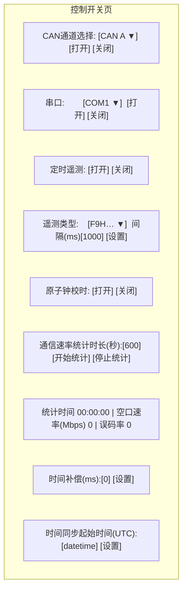

# 05 - 前端页面设计

前端基于 Vue3 + Element Plus，菜单由后端 `sys_menu` 驱动（`/getRouters` 动态路由）。
本章按菜单逐页给出布局、交互与对应接口。所有页面位于 `src/views/payload/` 下。

> 页面与 [03 章菜单规划](./03-数据库设计.md) 的 `component` 一一对应。

---

## 1. 菜单结构总览

```
遥控 (telecontrol)
 ├─ 控制开关 (control)        payload/telecontrol/control/index
 ├─ 遥控 (command)            payload/telecontrol/command/index
 └─ 指令序列 (sequence)       payload/telecontrol/sequence/index
遥测 (telemetry)
 ├─ 0xFF B-1主要包 …(共7个)   payload/telemetry/table/index   (query.type 区分)
 └─ 遥测曲线 (curve)          payload/telemetry/curve/index
单板 (board)
 └─ 相机测试 (camera)         payload/board/camera/index
LVDS (lvds)
 └─ 工程遥测 (engineering)    payload/lvds/engineering/index
重构 (refactor)               payload/refactor/index   (顶级单页，暂空白)
```

---

## 2. 遥控 - 控制开关 `control/index.vue`

> 参考 C++ `PayloadControlWidget`，效果图 `test/控制开关.jpg`。
> **布局要求**：效果图中 label 与输入框分两行，**本系统改为同一行**（label 左、控件右）。



| 区块         | 控件                                         | 动作 / 接口                                                       |
| ------------ | -------------------------------------------- | ---------------------------------------------------------------- |
| CAN 通道选择 | 下拉(CAN A/B…)、打开、关闭                    | `device/can/open`、`device/can/close`                            |
| 串口         | 下拉(COM…)、打开、关闭                        | `device/serial/open`、`device/serial/close`                     |
| 定时遥测     | 打开、关闭                                    | `telecontrol/control/op` `timedYc.enable`                       |
| 遥测类型     | 下拉(F9H/F7H…)、间隔(ms)、设置                | `telecontrol/control/op` `timedYc.param`                        |
| 原子钟校时   | 打开、关闭                                    | `telecontrol/control/op` `ppsTime.enable`                       |
| 通信速率统计 | 时长(秒)、开始、停止；显示统计时间/速率/误码率| `control/op` `rate.start`/`rate.stop`，结果轮询遥测/状态        |
| 时间补偿     | 偏移(ms)、设置                                | `control/op` `ppsTime.offset`                                  |
| 时间同步起始 | datetime(UTC)、设置                           | `control/op` `ppsTime.start`（UTC 换算**待确认**）             |

- 布局用 `el-form` + `label-width` 同行；或每行一个 `el-row`（label 列 + 控件列）。
- 「统计时间/空口速率/误码率」为只读展示，统计期间定时刷新（来自遥测字段 JGB132/133/135）。

---

## 3. 遥控 - 遥控页 `command/index.vue`

> 参考效果图 `test/遥控.jpg`、`test/遥控2.jpg`；功能参考 C++ `TeleControl`，但**界面按效果图采用三栏**。

三栏布局：

```mermaid
flowchart LR
  subgraph 左["指令列表 (树形)"]
    S[搜索框]
    T["分类(电源/标定/捕跟…)<br/>└ [Kxxxx] 指令名"]
  end
  subgraph 中["单条指令 / 指令序列 (Tabs)"]
    M1[指令代号/名称/参数HEX/参数长度]
    M2[参数输入区(按组件动态生成)]
    M3[发送指令]
  end
  subgraph 右["发送历史"]
    H[时间 + 指令名 + HEX + 状态]
    HC[清空]
  end
  左 --> 中 --> 右
```

### 左栏：指令树

- 顶部搜索框，按指令代号/名称过滤。
- 树形两级：**分类（页/orderList）→ 指令（order）**，数据来自 `telecontrol/config`。
- 点击叶子节点 → 中栏加载该指令详情。

### 中栏：单条指令（Tab1）

- 展示：指令代号、指令名称、指令参数(十六进制)、参数长度（字节）。
- **参数输入区**：依据指令的 `component[]` 动态渲染（同一行 label + 控件）：
  - `fixed` → 不显示输入（固定值参与组帧）；
  - `number` → 数字输入（按 dataType 限制范围/步进），带说明（title + 数字量换算提示）；
  - `select` → 下拉（options 的 value→label）；
  - `scientific` → 科学计数法输入（FLOAT/DOUBLE）。
- 参数 HEX 随输入**实时更新**（前端组装预览，规则见 [07 章](./07-遥控帧组装与遥测解析规则.md)）。
- 无参数指令显示「此指令无需参数」。
- 「发送指令」→ `telecontrol/send`（带 deviceId、orderId、hex）。
- 若指令含定时(timer>0)：提供「定时发送」间隔 + 启停（可选，二期）。

### 中栏：指令序列（Tab2）

- 此 Tab 可作为「指令序列」页的快捷入口，或直接复用 `sequence` 列表（**实现时二选一**，建议
  独立菜单页见第 4 节，本 Tab 仅做「把当前指令加入某序列」的快捷操作）。

### 右栏：发送历史

- 列表项：时间、指令名、HEX、状态图标（成功/失败）。
- 数据来自 `telecontrol/history`（Redis），定时刷新或发送后追加。
- 「清空」按钮清空展示（仅前端展示层，或调用清空接口）。

---

## 4. 遥控 - 指令序列 `sequence/index.vue`

> 标准 CRUD（参考 `system/post`），对应表 `payload_cmd_sequence`、接口 `/payload/sequence`。

- **列表**：序列名称、指令条数、备注、创建时间；操作列：修改、删除、**复制**。
- **复制**：点击「复制」→ 调 `sequence/{id}/copy` 取草稿 → **直接跳到「新增」对话框并预填**
  （名称带「-副本」），用户确认后保存。
- **新增/修改对话框**：
  - 序列名称；
  - 指令数组编辑器（可增删行、拖拽排序）：每行 = 指令 HEX 文本(`AA BB CC`) + 发送间隔(ms，默认 2000)；
  - 「从遥控指令选择」：弹出指令树（排除广播帧）选择，自动填充 HEX 与名称。
- **执行**（可选）：选择 deviceId → `sequence/{id}/run`，前端展示执行进度。


---

## 5. 遥测 - 遥测表 `telemetry/table/index.vue`

> 效果图 `test/遥测.jpg`、菜单 `test/普通遥测菜单.jpg`。7 个遥测表**共用本组件**，
> 通过路由 `query.type`（FF/FD/FB/F9/F7/FE/FC）区分。

- 顶部：标题「遥测监控」、连接状态徽标（已连接/未连接）。
- 表格列：**编号(id)、参数名称、当前值、单位、描述**。
- 数据：`telemetry/table?type={type}`，按固定间隔轮询刷新（默认 1s，可配置）。
- 变化高亮：本次刷新值与上次不同的单元格高亮（蓝/红）。
- 映射值：如「终端模式 = 待机模式」按配置 `value` 映射显示（见 [07 章](./07-遥控帧组装与遥测解析规则.md)）。
- **跳转曲线**：点击「当前值」单元格 → 跳到「遥测曲线」页，并带上当前 type+field，
  曲线页自动选中该遥测量并视为「已点确认」。

```js
// 由路由 query 取数据类型
const route = useRoute();
const type = computed(() => route.query.type || route.meta?.query?.type || "FF");
```

---

## 6. 遥测 - 遥测曲线 `telemetry/curve/index.vue`

> C++ 端无此功能，为新增页。使用 ECharts（已在依赖）。

- 顶部控件：**设备** → **遥测表** → **遥测量** → **增加/删除曲线**。
- 点击「增加曲线」后：按间隔调用 `telemetry/curve/data/batch` 拉取数据点并绘制（可多曲线叠加，最多 10 条）。
- **缩放**：ECharts `dataZoom`，支持选中一段区间放大/缩小。
- **入口二**：从遥测表页点数值进入时，自动选中对应表/量并立即增加曲线。
- Redis 在帧到达时已全字段落库，前端无需订阅接口。


---

## 7. 单板 - 相机测试 `board/camera/index.vue`

> 参考 `test/showimg/serial_image_viewer.py`。通过串口获取图像数据。

- 控制面板（同一行）：串口下拉、刷新、连接/断开、分辨率(400/256/128/64)、图像序号(1~64)、开始刷新、停止刷新。
- 图像显示区：展示最新整帧灰度图（等比缩放）。
- 状态栏：采集进度/重试/错误提示。
- 交互：
  - 连接 → `device/serial/open`；
  - 开始刷新 → `camera/start`（port, resolution, imageNo）；前端定时 `camera/image` 拉取最新图并显示；
  - 停止 → `camera/stop`；断开 → `device/serial/close`。
- 协议细节见 [07 章相机图像协议](./07-遥控帧组装与遥测解析规则.md)。

---

## 8. LVDS - 工程遥测 `lvds/engineering/index.vue`

> 效果图 `test/工程遥测.jpg`。高速信号实时波形（类示波器），工程遥测类型 `7E9B/7E9D/7E9F`。

三栏布局：

| 区域       | 内容                                                                            |
| ---------- | ------------------------------------------------------------------------------- |
| 顶部状态条 | 采样率(KHz)、渲染帧率(FPS)、总点数/秒、暂停/继续                                 |
| 左：信号选择 | 已选 N/8；信号列表（名称 + 变量名，如 `QD x坐标 / qd_x_pos`）；清空选择；提示    |
| 中：波形图   | ECharts 多通道折线（**最多 8 条**）；右键添加游标、拖拽游标看数值              |
| 右：测量面板 | 目标信号下拉；游标类型(垂直时间/水平幅值)；游标1/2 开关；C1/C2 X/Y；ΔX(ΔT)/ΔY/Freq |

- 数据：采集进程把高速信号点写入 `payload:{id}:lvds:{signal}`（限频/限量），前端高频拉取或分批渲染。
- 性能：大数据量波形建议使用 ECharts `large`/`sampling`，或 Canvas 直绘；渲染帧率展示实测 FPS。
- **协议与信号清单待确认**（C++ `LvdsLink` 下相关 widget 可参考）。

---

## 9. 重构 `refactor/index.vue`

- 顶级单页，点击菜单直接显示，无二级菜单。
- 当前为**空白占位页**（标题 + 「功能建设中」提示），后续按需补充。

---

## 10. 前端工程约定

- API 封装放 `src/api/payload/`，每个控制器一个文件（device.js / telecontrol.js / telemetry.js / sequence.js / camera.js）。
- 复用框架组件：`pagination`、`right-toolbar`、`dict-tag`；权限指令 `v-hasPermi`。
- 轮询统一封装（进入页面启动、离开页面 `onUnmounted` 清理定时器）。
- 遥测/曲线/工程遥测的实时刷新先用 **HTTP 轮询**；如后续需要更低时延，可评估引入 WebSocket（当前框架未使用 WS）。
- 组件路径必须与 `sys_menu.component` 完全一致（不含 `.vue`）。
