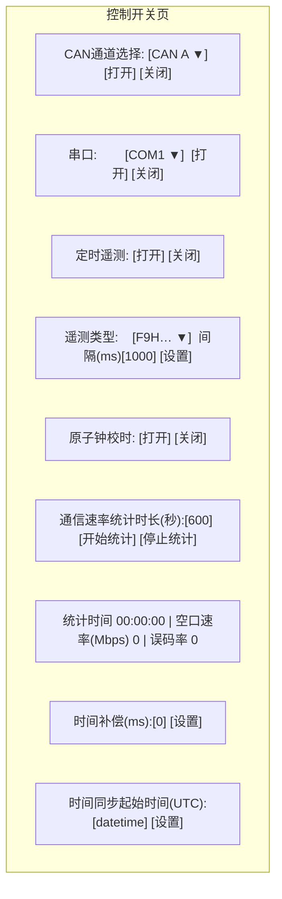
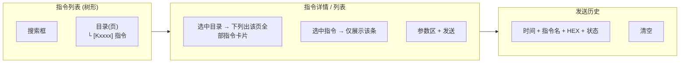

# 05 - 前端页面设计

前端基于 Vue3 + Element Plus，菜单由后端 `sys_menu` 驱动（`/getRouters` 动态路由）。
本章按菜单逐页给出布局、交互与对应接口。业务页面位于 `src/views/payload/`；
**首页设备服务**位于 `src/views/dashboard/index.vue`；共用连接弹窗位于 `src/components/Payload/`。

> 页面与 [03 章菜单规划](./03-数据库设计.md) 的 `component` 一一对应（首页除外，走框架默认首页路由）。

---

## 0. 首页 · 设备服务 `dashboard/index.vue`

> 当前已打开的 CAN / 串口 / UDP 监听服务总览；在此新建连接、绑定/修改组装器与解释器、关闭连接。

### 布局（无卡片边框/背景，贴近「在线用户」表风格）

```
设备服务  <小字提示：当前已打开的…>（标题行，提示右对齐下对齐）
[＋新建 CAN] [＋新建 UDP] [＋新建串口]          [刷新] [自动刷新]
────────────────────────────────────────────────────────
| 类型 | 设备ID | 连接信息 | 来源 | 组装器ⓘ | 解释器ⓘ | 打开时间 | 操作 |
```

- 容器：`app-container device-service-page`，**无边框、无背景色**（不用 `el-card`）。
- 表头独立底色、行悬停高亮；**不做斑马纹交替行**。
- 「组装器 / 解释器」表头带 `?` tooltip，文案与全局共用（见 §11）。
- 操作：「修改」打开绑定对话框；「关闭连接」二次确认后关通道。
- 新建按钮样式：`type="primary" plain` + `Plus` 图标（与系统「新增」按钮一致）。

### 新建连接（独立组件，不内嵌大段表单）

| 按钮 | 组件 | 说明 |
| ---- | ---- | ---- |
| 新建 CAN 连接 | `CanConnectDialog.vue` | 厂商/索引/通道/波特率/线缆/目标地址 + 组装器/解释器 |
| 新建 UDP 连接 | `UdpConnectDialog.vue` | 本机地址/端口 + 组装器/解释器 |
| 新建串口连接 | `SerialConnectDialog.vue` | `mode=free`，`source=home`，可改物理参数；已开串口禁用 |

打开成功后刷新列表；偏好写入 `localStorage`（如 `payload:control:canPrefs` 等）。
设备快照可走浏览器缓存 `deviceSnapshotCache`（约 30s），见 §11。

### 修改绑定

对话框内可改组装器（清空→透传）与解释器（清空→解绑）；调用设备绑定接口（见 [04](./04-后端接口设计.md)）。

---

## 1. 菜单结构总览

```
首页 (dashboard)                  views/dashboard/index          设备服务列表
遥控 (telecontrol)
 ├─ 控制开关 (control)            payload/telecontrol/control/index
 ├─ 遥控 (command)                payload/telecontrol/command/index
 └─ 指令序列 (sequence)           payload/telecontrol/sequence/index
遥测 (telemetry)
 ├─ 0xFF B-1主要包 …(共7个)       payload/telemetry/table/index   (路径/query 区分类型)
 ├─ 遥测曲线 (curve)              payload/telemetry/curve/index
 └─ 归档曲线 (archive)            payload/telemetry/archive/index
单板 (board)
 ├─ 相机测试 (camera)             payload/board/camera/index
 ├─ 热控电机 (rkdj)               payload/board/rkdj/index        → XlBoardPage
 └─ CPA-ZK (zk)                   payload/board/zk/index          → XlBoardPage
调试 (debug)                      （开发/联调用）
 ├─ 数据模拟 (simulate)           payload/debug/simulate/index
 ├─ 数据收发 (xfer)               payload/debug/xfer/index
 └─ 配置 (config)                 payload/debug/config/index
LVDS (lvds)
 └─ 工程遥测 (engineering)        payload/lvds/engineering/index
重构 (refactor)                   payload/refactor/index
```

> 实际菜单以库表 `sys_menu` 为准；上表反映**代码侧页面布局**。

---

## 2. 遥控 - 控制开关 `control/index.vue`

> 参考 C++ `PayloadControlWidget`，效果图 `test/控制开关.jpg`。
> **布局要求**：效果图中 label 与输入框分两行，**本系统改为同一行**（label 左、控件右）。


```mermaid
flowchart TB
  subgraph 控制开关页
    A["CAN通道选择: [CAN A ▼] [打开] [关闭]"]
    B["串口:        [COM1 ▼]  [打开] [关闭]"]
    C["定时遥测:    [打开] [关闭]"]
    D["遥测类型:    [F9H… ▼]  间隔(ms)[1000] [设置]"]
    E["原子钟校时:  [打开] [关闭]"]
    F["通信速率统计时长(秒):[600] [开始统计] [停止统计]"]
    G["统计时间 00:00:00 | 空口速率(Mbps) 0 | 误码率 0"]
    H["时间补偿(ms):[0] [设置]"]
    I["时间同步起始时间(UTC):[datetime] [设置]"]
  end
```

| 区块         | 控件                                         | 动作 / 接口                                                       |
| ------------ | -------------------------------------------- | ---------------------------------------------------------------- |
| CAN 通道选择 | 下拉(CAN A/B…)、打开、关闭                    | `device/can/open`、`device/can/close`                            |
| 串口         | 下拉(COM…)、打开、关闭                        | `device/serial/open`、`device/serial/close`                     |
| 定时遥测     | 打开、关闭                                    | `telecontrol/control/op` `timedYc.enable`                       |
| 遥测类型     | 下拉(F9H/F7H…)、间隔(ms)、设置                | `telecontrol/control/op` `timedYc.param`                        |
| 原子钟校时   | 打开、关闭                                    | `telecontrol/control/op` `ppsTime.enable`                       |
| 通信速率统计 | 时长(秒)、开始、停止；显示统计时间/速率/误码率| `control/op` `rate.start`/`rate.stop`，结果轮询遥测/状态        |
| 时间补偿     | 偏移(ms)、设置                                | `control/op` `ppsTime.offset`                                  |
| 时间同步起始 | datetime(UTC)、设置                           | `control/op` `ppsTime.start`（UTC 换算**待确认**）             |

- 布局用 `el-form` + `label-width` 同行；或每行一个 `el-row`（label 列 + 控件列）。
- 「统计时间/空口速率/误码率」为只读展示，统计期间定时刷新（来自遥测字段 JGB132/133/135）。

---

## 3. 遥控 - 遥控页 `command/index.vue`

> 参考效果图 `test/遥控.jpg`、`test/遥控2.jpg`；功能参考 C++ `TeleControl`，**三栏布局**。


```mermaid
flowchart LR
  subgraph 左["指令列表 (树形)"]
    S[搜索框]
    T["目录(页)<br/>└ [Kxxxx] 指令"]
  end
  subgraph 中["指令详情 / 列表"]
    M1[选中目录 → 下列出该页全部指令卡片]
    M2[选中指令 → 仅展示该条]
    M3[参数区 + 发送]
  end
  subgraph 右["发送历史"]
    H[时间 + 指令名 + HEX + 状态]
    HC[清空]
  end
  左 --> 中 --> 右
```

### 左栏：指令树

- 顶部搜索框，按指令代号/名称过滤（多关键词空格 AND）。
- 树形两级：**目录（page）→ 指令（order）**，数据来自 `telecontrol/config`（字段为 `page` / `order`）。
- **`expand-on-click-node=false`**：箭头展开/折叠；点击节点为选中。
- 点击**目录** → 中间列出该目录下全部指令；点击**指令** → 中间仅该条。
- 搜索过滤时：若仍选中目录，中间列表同步过滤；无匹配时复用空状态文案「请从左侧选择目录或指令」。

### 中栏：指令卡片

- 展示：指令代号、名称、参数 HEX、参数长度；按 `component[]` 动态渲染（fixed / number / select / scientific）。
- 参数 HEX 随输入实时更新（规则见 [07](./07-遥控帧组装与遥测解析规则.md)）。
- 「发送」→ `telecontrol/send`；历史写入 Redis。
- 中间区滚动条与内容边框留白：`.panel-detail { padding-right: 5px; }`。

### 右栏：发送历史

- 列表项：时间、指令名、HEX、状态；`telecontrol/history` 定时刷新；支持清空。

---

## 4. 遥控 - 指令序列 `sequence/index.vue`

> 标准 CRUD（参考 `system/post`），对应表 `payload_cmd_sequence`、接口 `/payload/sequence`。

- **列表**：序列名称、指令条数、备注、创建时间；操作列：修改、删除、**复制**。
- **复制**：点击「复制」→ 调 `sequence/{id}/copy` 取草稿 → **直接跳到「新增」对话框并预填**
  （名称带「-副本」），用户确认后保存。
- **新增/修改对话框**：
  - 序列名称；
  - 指令数组编辑器（可增删行、拖拽排序）：每行 = 指令 HEX 文本(`AA BB CC`) + 发送间隔(ms，默认 2000)；
  - 「从遥控指令选择」：弹出指令树（排除广播帧）选择，自动填充 HEX 与名称。
- **执行**（可选）：选择 deviceId → `sequence/{id}/run`，前端展示执行进度。


```mermaid
flowchart LR
  L[序列列表] -->|复制| C[copy接口取草稿]
  C --> N[打开新增对话框并预填]
  N -->|确认| Save[保存]
```

---

## 5. 遥测 - 遥测表 `telemetry/table/index.vue`

> 效果图 `test/遥测.jpg`、菜单 `test/普通遥测菜单.jpg`。7 个遥测表**共用本路由页**，
> 通过路径 `tmFF` 等或 `query.type`（FF/FD/…）区分。
>
> **实现**：页面本身为薄壳，实际表格与轮询逻辑在共用组件
> [`PayloadTelemetryTable.vue`](../ruoyi-fastapi-frontend/src/components/Payload/PayloadTelemetryTable.vue)
> （`level="t1"`）。

- 顶部（所有使用方一致）：类型（标题或下拉）、来源徽标、数据时间、刷新时间；`level=t1` 上下留白最大。
- 表格列：**编号(id)、参数名称、当前值、单位、HEX**；编号悬停显示配置 JSON。
- 数据：统一 `GET /payload/telemetry/table?type={type}`，约 1s 轮询；`dataId`/`changed` 未变则不重绘。
- 无热数据时用配置表骨架占位；配置可缓存到 `localStorage`（`payload:tmCfg:v1:tm:{TYPE}`）。
- 变化高亮：原值非空且变更时当前值标红。
- **跳转曲线**：双击「当前值」→ `/telemetry/curve?type=&field=`。

```js
// 优先路径 tmFF，兼容旧链接 ?type=FF
const tmType = computed(() => /* 从 route 解析 */)
// <PayloadTelemetryTable level="t1" :types="tmTypes" />
```

---

## 6. 遥测 - 遥测曲线 `telemetry/curve/index.vue`

> C++ 端无此功能，为新增页。使用 ECharts（已在依赖）。

- 顶部控件：**设备** → **遥测表** → **遥测量** → **增加/删除曲线**。
- 点击「增加曲线」后：按间隔调用 `telemetry/curve/data/batch` 拉取数据点并绘制（可多曲线叠加，最多 10 条）。
- **缩放**：ECharts `dataZoom`，支持选中一段区间放大/缩小。
- **入口二**：从遥测表页点数值进入时，自动选中对应表/量并立即增加曲线。
- Redis 在帧到达时已全字段落库，前端无需订阅接口。

另有 **归档曲线** `telemetry/archive/index.vue`：查 MySQL 永久层（由 `archive:queue` 异步写入），不读热 ZSet。

---

## 7. 单板

### 7.1 相机测试 `board/camera/index.vue`

> 参考 `test/showimg/serial_image_viewer.py`。控制串口 + 图像串口分源打开。

- 使用共用 `SerialConnectDialog`（`mode=preset`）：
  - 控制源 `camera_ctrl`、图像源 `camera_image`；图像口可复用匹配串口、波特率可编辑。
- **传输信息**面板 `PayloadTransferInfo`：按 `source:*` 读 IO；多源横向按钮切换，**不因新开第二路自动跳源**。
- **遥测区**：嵌入 `PayloadTelemetryTable`（`level="t3"`），`types` 传两项（`D8`/`D9`）→ 头部自动显示下拉；数据走首页同一接口 `/payload/telemetry/table`。
  - `@data-change` 解析 CAM027 同步分辨率下拉（板级特有逻辑保留在相机页）。
- 图像区：分辨率/序号、开始/停止刷新；协议见 [07](./07-遥控帧组装与遥测解析规则.md)。

### 7.2 热控电机 / CPA-ZK `XlBoardPage.vue`

- `rkdj` / `zk` 薄封装同一页组件；串口 `SerialConnectDialog` + 传输信息 + 指令区。
- **遥测区**：嵌入 `PayloadTelemetryTable`（`level="t3"`），`types` 只传一项（`RKDJ` 或 `ZK`）→ 头部显示标题。
- Select 类控件无有效默认值时默认选第一项。

---

## 8. 调试

### 8.1 数据模拟 `debug/simulate/index.vue`

- **通用数据发送模拟**：选「帧组装类型 / 帧解析类型」→ HEX → `POST /payload/telemetry/dev/pipeline`（组装器→解释器→写 Redis，来源 `http:devtest`）。
  - 标签旁 tooltip 与首页共用 `ASSEMBLER_TIP` / `PARSER_TIP`。
- **CAN 遥测复合帧模拟**：直接注入完整复合帧 → 开发注入接口。

### 8.2 数据收发 `debug/xfer/index.vue`

- 选在线/历史设备，发 HEX、看 IO 日志（按设备 `payload:{deviceId}:io`）。

### 8.3 配置 `debug/config/index.vue`

- 调试用配置查看/操作入口（以页面实现为准）。

---

## 9. LVDS - 工程遥测 `lvds/engineering/index.vue`

> 效果图 `test/工程遥测.jpg`。高速信号实时波形（类示波器），工程遥测类型 `7E9B/7E9D/7E9F`。

三栏布局：

| 区域       | 内容                                                                            |
| ---------- | ------------------------------------------------------------------------------- |
| 顶部状态条 | 采样率(KHz)、渲染帧率(FPS)、总点数/秒、暂停/继续                                 |
| 左：信号选择 | 已选 N/8；信号列表（名称 + 变量名，如 `QD x坐标 / qd_x_pos`）；清空选择；提示    |
| 中：波形图   | ECharts 多通道折线（**最多 8 条**）；右键添加游标、拖拽游标看数值              |
| 右：测量面板 | 目标信号下拉；游标类型(垂直时间/水平幅值)；游标1/2 开关；C1/C2 X/Y；ΔX(ΔT)/ΔY/Freq |

- 数据：采集进程把高速信号点写入 `payload:{deviceId}:lvds:{signal}`（限频/限量），前端高频拉取或分批渲染。
- 性能：大数据量波形建议使用 ECharts `large`/`sampling`，或 Canvas 直绘；渲染帧率展示实测 FPS。
- **协议与信号清单待确认**（C++ `LvdsLink` 下相关 widget 可参考）。

---

## 10. 重构 `refactor/index.vue`

- 顶级单页，点击菜单直接显示，无二级菜单。
- 当前为**空白占位页**（标题 + 「功能建设中」提示），后续按需补充。

---

## 11. 共用组件与前端缓存约定

### 11.1 `src/components/Payload/`

| 组件 | 用途 |
| ---- | ---- |
| `SerialConnectDialog.vue` | 串口打开；`mode=free\|preset`；`source` 写入会话；可选组装器/解释器 |
| `CanConnectDialog.vue` | 首页等新建 CAN |
| `UdpConnectDialog.vue` | 首页等新建 UDP |
| `PayloadTelemetryTable.vue` | 通用遥测表：`types`（数组，1 项→标题、多项→下拉）+ `level=t1\|t2\|t3`（头部与列宽档位）；轮询 `/payload/telemetry/table`；首页与单板共用 |
| `PayloadTransferInfo.vue` | 单板传输信息；按 `source` / 设备读 IO；多源粘滞切换 |
| `IoLogPanel.vue` / `RawDataSendPanel.vue` / `CameraImageView.vue` | IO 展示、原始发送、图像显示 |

### 11.2 组装器 / 解释器说明文案（统一）

`src/utils/pipelineTips.js`：

| 键 | 文案 |
| -- | ---- |
| `ASSEMBLER_TIP` | 依据帧头与帧尾识别帧边界，从数据流中还原完整帧并提取有效数据。 |
| `PARSER_TIP` | 对帧有效数据进行编解码，解析为业务字段。 |

用于：数据模拟标签、新建连接表单项、首页列表表头（含「修改绑定」对话框）。

### 11.3 浏览器缓存

| 工具 | 作用 |
| ---- | ---- |
| `deviceSnapshotCache.js` | 设备快照 sessionStorage ~30s；活动设备 ID ~8h |
| `telemetryCfgCache.js` | 遥测配置 localStorage ~1h（如 `payload:tmCfg:v1:camera:D8`） |
| `serialConnectMeta.js` | 串口连接元数据辅助（复用快照能力） |

### 11.4 工程约定

- API 封装放 `src/api/payload/`（device / telecontrol / telemetry / sequence / camera …）。
- 复用框架组件：`pagination`、`right-toolbar`、`dict-tag`；权限指令 `v-hasPermi`。
- 轮询统一：进入页面启动、`onUnmounted` 清理。
- 实时刷新先用 **HTTP 轮询**；组件路径与 `sys_menu.component` 一致（不含 `.vue`）。
