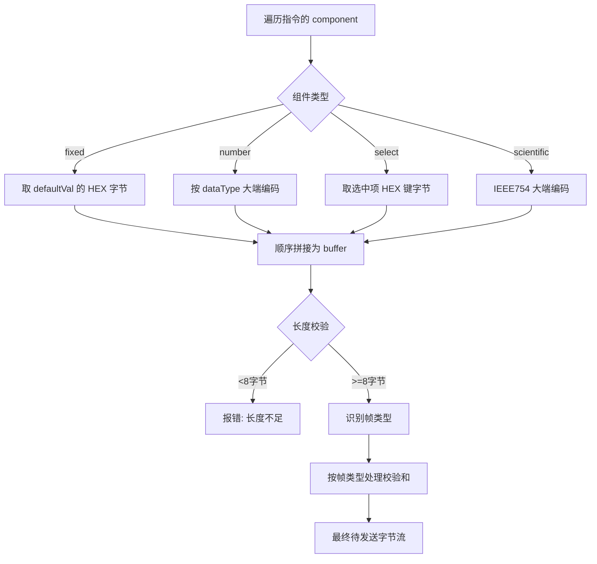

# 07 - 遥控帧组装与遥测解析规则

本章把 C++ 端的关键算法沉淀为可在 Python 端复现的规则，是采集进程实现的核心依据。
来源：`test/GeniusProsSoftPlatform`（`TeleControlTableOrderWidget`、`TeleMetryCfg`、
`CanBaseWidget`）与 `gpcan` 库定义。

---

## 1. 遥控指令组装

### 1.1 总流程



### 1.2 组件值编码

| 类型         | 编码规则                                                                                 |
| ------------ | ---------------------------------------------------------------------------------------- |
| `fixed`      | 直接把 `defaultVal`（HEX 字符串）转为字节，原样拼接                                       |
| `number`     | 按 `dataType` 把整数值转为**大端**字节：INT8/UINT8→1B，INT16/UINT16→2B，INT24/UINT24→3B，INT32/UINT32→4B |
| `select`     | 取下拉选中项的 HEX 键（如 `0xAAAA`）转为字节（按其位宽）                                  |
| `scientific` | 按 `dataType`：FLOAT→IEEE754 单精度 4B 大端；DOUBLE→双精度 8B 大端                         |
| `hex`(若有)  | 左侧补 `0` 到所需宽度后转字节                                                             |

> **大端序（Big-Endian）**：所有多字节数值高位在前。Python 可用
> `struct.pack('>h', v)`（INT16）、`struct.pack('>I', v)`（UINT32）、`struct.pack('>f'/'>d', v)`（浮点）。
> INT24/UINT24 需手动取 3 字节。

### 1.3 帧类型识别与校验和

组装后按缓冲长度取「帧类型字节」：

- `len == 8`：帧类型 = `buf[0]`；
- `len > 8`：帧类型 = `buf[2]`（复合帧，前两字节为长度/头）。

处理规则（源自 C++ `getOrderData`）：

| 帧类型（示例）                   | 值     | 处理                                              |
| -------------------------------- | ------ | ------------------------------------------------- |
| 遥控单帧（YK）                   | `0x0A` | 直接发送                                           |
| 遥测请求                         | `0x00` | 直接发送                                           |
| 星上时广播（单帧）               | `0x30` | 直接发送，**广播（全通道）**                       |
| 遥控复合帧（YK complex）         | `0x0F` | 若 `len==dataLen+2` 追加 1 字节校验和；`+3` 则校验 |
| 姿轨广播（复合帧）               | `0x1A` | 同上复合帧规则，**广播（全通道）**                 |

- **校验和算法**：字节累加和取低 8 位（`sum(bytes) & 0xFF`）。
- C++ 端**不使用配置里的 `check` 字段**判断是否加校验，而是依据帧类型/长度自动处理；本系统沿用。

### 1.4 广播帧（广播帧识别 / 指令序列排除）

- 广播帧 = 帧类型 ∈ `{0x30(星上时), 0x1A(姿轨)}`（或配置中归属「广播」分类页，如 C++ 的 page `1008`）。
- 广播帧发送时**面向全部 CAN 通道**（`all_channel=true`，底层目标通道传空表示全部）。
- **指令序列排除广播帧**：构建/保存指令序列时，过滤掉广播帧指令（前端选择时过滤 + 后端保存校验）。

### 1.5 CAN ID 组成（业务层发送）

`gpcan` 业务层 `send_msg(CanMsgReq(...))` 会依据 `CanMsgParam` 自动生成 CAN ID 并按需分帧。
ID 各位含义（见 `gpcan.can_def`）：

| 位       | 含义                              | 取值                                              |
| -------- | --------------------------------- | ------------------------------------------------- |
| 第10位   | 节点类型 `CanNodeType`            | 主(上位机)=0 / 从(终端)=1                          |
| 第9~8位  | 帧类型 `CanFrameType`             | 点对点=0x2 / 广播=0x0；应用数据=0x1 / 总线数据=0x0 |
| 第2位    | AB 线 `CanCableFlag`              | A=0 / B=1                                          |
| 第1~0位  | 复合帧标志 `CanFrameFlag`         | 单帧0 / 起始1 / 中间2 / 尾帧3                       |

节点地址 `CanNodeAddr`：星务计算机 `0x00`、激光终端A `0x0C`、激光终端B `0x0D`。

> 实现建议：
> - 复合/广播等带业务语义的帧优先用 `send_msg`（库负责 ID 与分帧）；
> - 已是「最终帧」的固定 HEX 可用 `send(id, data, …)` 或 `send_obj`。
> - 上位机为主节点，默认目标 `n_node_addr_to=0x0D`（激光终端B），A 线 `n_cable_flag=0`。

---

## 2. 遥测解析

### 2.1 遥测帧定位

参考 `test/TeleMetry/TeleMetryCmd.py`：

- 整帧（含帧头）中**第 3 字节（index=3）为数据类型**；payload 从第 4 字节（index=4）开始。
- 数据类型 → 取表键：`key = f"{frame[3]:02X}"`（如 `FF`）。

```python
key = f"{int(parts[3], 16):02X}"     # 数据类型
payload_hex = " ".join(parts[4:])    # 去掉帧头后的数据
lines = mgr.parse_hex(key, payload_hex)
```

### 2.2 字段解析（按 row 定义）

对每个 `row`：

1. `bits < 8`：位域，从 `bytepos` 起按 `bitpos`/`bits` 取位；
2. `bits` ∈ [8,64]：从 `bytepos` 读 `bits/8` 字节，按 `dataType` 大端解释为数值；
3. `bits > 64`：作为原始 HEX 块展示。

### 2.3 显示值计算（getLineValueShow 等价逻辑）

```mermaid
flowchart TB
  V{value 映射非空?} -- 是 --> Map[按位串/0x键查表→文本]
  V -- 否 --> Fm{formula != 'D'?}
  Fm -- 是 --> Expr[tinyexpr 求值 D=原始值] --> Fmt[按 fmt 格式化]
  Fm -- 否 --> Fmt
  Fmt --> Time{fmt == '%time'?}
  Time -- 是 --> T[值+纪元(2020-01-01)→UTC字符串]
  Time -- 否 --> Show
  T --> Show
  Map --> Show
  Show --> ST{showType>0?}
  ST -- 是 --> Compose[显示 公式结果(原始结果)]
  ST -- 否 --> U[拼接 unit]
  Compose --> U --> Done[最终显示文本]
```

- `formula` 支持算术表达式，`D` 表示原始数值（如 `D+8*3600`、`D*0.01`）。
- `fmt` 为 C 风格格式：`%d`(有符号)、`%u`/`%hu`(无符号)、`%04X`(十六进制)、`%time`(时间)、`%.2f` 等。
- `value` 映射：键可为位串或 `0x..` HEX；命中则显示对应文本（如「终端模式→待机模式」）。

> 这些逻辑封装在 `telemetryparser` 库内，采集进程调用 `parse_hex` 即得到 `show` 文本，
> **无需自行重写**；本节用于理解与排错。

### 2.4 输出结构

`parse_hex` 返回字段行（`TeleMetryLine`）：`id`、`name`、`show`(显示文本)、`hex`、`err`(解析错误标志)。
另含一行合成的 `RecvDateTime`（接收时间）。采集进程把这些行 + 单位封装为 [02 章](./02-数据采集层设计.md) 的遥测 JSON。

---

## 3. 相机图像协议（串口）

> 源：`test/showimg/serial_image_viewer.py`。串口参数：波特率 2_000_000、8 数据位、奇校验(ODD)、1 停止位。

### 3.1 帧格式

| 帧       | 长度    | 结构                                                                 |
| -------- | ------- | -------------------------------------------------------------------- |
| 请求帧   | 10 字节 | `EB 90` + 类型`D6` + 帧ID + 数据长(0x0001) + 序号(2B) + 图像号(1B) + 校验 |
| 应答帧   | 266 字节| `EB 90` + 类型`D6` + … + 序号(2B) + 图像号 + **256B 图像分片** + 校验 |

- 帧 ID：首帧 `0x04`、中间帧 `0x02`、尾帧 `0x01`。
- 校验：从类型字节到分片末尾的字节累加和低 8 位。

### 3.2 整图重组


- 总像素 = W×H，每帧 256 字节，帧数 = 总像素/256；
- 分辨率：400×400 / 256×256 / 128×128 / 64×64；图像号 1~64。
- 单帧失败重试 5 次，超限则整图重采。
- 重组后为 `uint8` 灰度图（`reshape(H, W)`），转 PNG 供前端展示。

---

## 4. 工程遥测（LVDS 高速）解析

- 工程遥测数据类型：`7E9B`、`7E9D`、`7E9F`。
- 解析为高速信号点（如 QD 坐标、各象限能量、CPA 指令等），供「工程遥测」波形页展示（最多 8 路）。
- **具体协议与信号清单待确认**：可参考 C++ `LvdsLink` 下相关 widget 与工程遥测配置；
  采集进程就地解析后按信号写入 `payload:{id}:lvds:{signal}` 时间序列。

---

## 5. 实现校验清单

实现遥控组帧后，建议用 `test/pygpcan/README.md` 中的样例帧做对拍验证：

```text
# 单帧
0A 91 00 01 00 01 55 55
# 复合帧
00 14 0F 92 88 33 3F 80 00 00 40 00 00 00 40 40 00 00 40 80 00 00 AF
# 广播
00 75 1A 00 … 8F
```

- 用配置中的 `defaultVal`（如 `K1502 = 0A9100040004AAAA`）核对「全 fixed」指令组帧结果；
- 用 `test/TeleMetry/TeleMetryCmd.py` 内置 `data_list` 帧核对遥测解析的 `show` 值。
