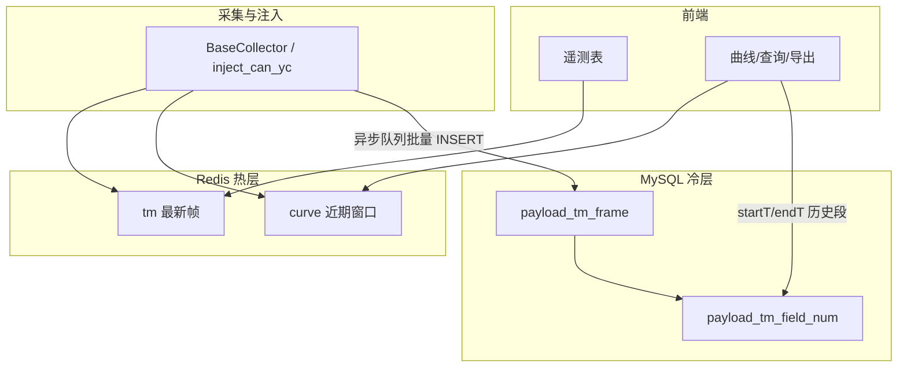

# 11 · 遥测永久存储与表结构设计

> 目标：遥测数据**永久保存**；每帧同时保留**原始二进制/HEX**与**解析结果**；后续页面可按 `[起始时间, 结束时间]` 加载历史，用于图表展示与 CSV 导出（均为解析后数据）。
>
> **数据库选型：优先 MySQL**（与 RuoYi 框架默认一致，见 [`config/env.py`](../ruoyi-fastapi-backend/config/env.py) `db_type=mysql`）。  
> Redis 仅作热数据层，**不作为永久归档库**。
>
> **字段演进**：`data_kind` / `data_sub` / `src_kind` / `src_param` / `parser_id` 见 [12-数据解析与来源归档重构](./12-数据解析与来源归档重构.md)（继续分区、不建类型表）。

相关现状文档：[09-遥测 Redis 与显示流程](./09-遥测Redis存储与前后端显示流程.md)

---

## 一、四个问题的结论

| # | 问题 | 结论 |
| - | ---- | ---- |
| 1 | 存 Redis 还是数据库？ | **双层**：Redis = 热（最新帧 + 近期曲线）；**MySQL = 永久归档** |
| 2 | 存原始还是解析？ | **两者都存**：同一帧一行，`raw_hex` + `parsed_json` |
| 3 | 四种组合怎么选？ | 不是四选一，而是 **Redis(热) + MySQL(冷，原始+解析)** |
| 4 | 20+ 表类型、字段数不同，表怎么设计？ | **不按类型建物理表**；统一帧表 + 数值时序副表，用 `data_sub` / `field_id` 区分（见 doc/12） |

---

## 二、Redis 能当永久数据库吗？

**不能替代 MySQL 做永久归档。**

| 点 | 说明 |
| -- | ---- |
| 定位 | 内存数据库，RDB/AOF 用于崩溃恢复，不是面向「数年、亿级行」的查询引擎 |
| 当前曲线 | 每字段 ZSet，上限 `CURVE_MAX_POINTS=50000`，**环形缓冲**，会丢最旧点 |
| 体量 | 1Hz × 20 表 × ~100 字段/表，单设备曲线点一天可达**数亿** member，内存不可接受 |
| 区间查询 | 按时间范围导出/绘图，关系库 + 索引/分区更合适 |

**Redis 保留职责（不变）：**

- `payload:{device}:tm:{TYPE}` — 最新一帧（遥测表轮询）
- `payload:{device}:curve:{TYPE}:{field}` — 近期曲线窗口（秒级刷新）

---

## 三、SQLite 能永久存吗？多大会有问题？

| 场景 | 建议 |
| ---- | ---- |
| 本地开发、单设备、保留数月 | 可用，但建议**独立** `payload_telemetry.db`，不要和 `ruoyi-fastapi.db` 混库 |
| 生产、永久、1Hz、20+ 表、全字段 | **用 MySQL**，不用 SQLite 扛全量 |

SQLite 工程瓶颈：单写者锁、单文件与系统库耦合、亿级行查询与 VACUUM 慢。理论容量很大，但**不适合**本项目的永久全量遥测归档。

---

## 四、总体架构（Redis 热 + MySQL 冷）

```text
设备 / 开发注入
      │
      ▼
采集 parse / inject_can_yc
      │
      ├─► Redis（同步）     最新帧 + 近期曲线 ZSet
      │
      └─► MySQL（异步批量）  payload_tm_frame + payload_tm_field_num
                ▲
                │  时间范围超出 Redis 窗口时
      曲线/导出 ─┘
```



**写入原则：**

1. 解析成功后 **先写 Redis**（不阻塞实时显示）。
2. 将 `{data_sub, src_param, ts, raw_hex, parsed_json, ...}` 投递归档队列，**后台 worker 批量写 MySQL**。
3. 归档失败可重试；热数据仍可用。

---

## 五、MySQL 表设计

> **以 `sql/ruoyi-fastapi-mysql.sql` 与 [doc/12](./12-数据解析与来源归档重构.md) 为准**。下列为现行结构摘要。

### 5.1 设计原则

- **一帧一行**：原始与解析同事务写入，保证一致。
- **不按 `FF/FC/…` 建多张业务表**：子类型用 `data_sub`；来源用 `src_kind` / `src_param`；新增类型只增配置，不改 DDL。
- **曲线/导出走数值副表**：避免每次扫大 JSON；字符串/枚举类仍从 `parsed_json` 读。
- **按月 RANGE 分区**：永久数据按 `ts_ms` 分区，便于清理、归档、查询裁剪。

> MySQL 分区要求：**主键/唯一键必须包含分区列** `ts_ms`，故采用 `PRIMARY KEY (id, ts_ms)`。

---

### 5.2 表 1：`payload_tm_frame`（核心归档）

每收到一帧遥测（每种 `data_sub` 一帧）插入一行。

```sql
CREATE TABLE payload_tm_frame (
  id           BIGINT       NOT NULL AUTO_INCREMENT COMMENT '自增ID',
  ts_ms        BIGINT       NOT NULL COMMENT '帧时间戳(ms)',
  data_kind    VARCHAR(16)  NOT NULL COMMENT '数据大类 tm/...',
  data_sub     VARCHAR(16)  NOT NULL COMMENT '子类型 FF/FC/...',
  src_kind     VARCHAR(16)  NOT NULL COMMENT '来源 can/serial/udp/http',
  src_param    VARCHAR(128) NOT NULL COMMENT '来源参数',
  parser_id    VARCHAR(64)  DEFAULT NULL COMMENT '解释器ID',
  raw_hex      MEDIUMTEXT   NOT NULL COMMENT '完整复合帧 HEX',
  parsed_json  JSON         NOT NULL COMMENT '解析结果',
  field_count  INT          NOT NULL COMMENT '字段个数',
  cfg_version  VARCHAR(64)  DEFAULT NULL COMMENT '配置版本',
  created_at   DATETIME(3)  DEFAULT CURRENT_TIMESTAMP(3) COMMENT '入库时间',
  PRIMARY KEY (id, ts_ms),
  KEY idx_kind_sub_ts (data_kind, data_sub, ts_ms),
  KEY idx_src_ts (src_kind, src_param, ts_ms),
  KEY idx_ts (ts_ms)
) ENGINE=InnoDB DEFAULT CHARSET=utf8mb4
COMMENT='遥测帧永久归档：原始+解析'
PARTITION BY RANGE (ts_ms) (...);
```

**`parsed_json` 建议结构**（与 Redis 最新帧对齐）：

```json
{
  "name": "B-1主要包",
  "dataKind": "tm",
  "dataSub": "FF",
  "srcKind": "can",
  "srcParam": "can:0:0:0",
  "parserId": "tm_can_yc",
  "fields": [
    {
      "id": "JGB001",
      "name": "遥测请求指令计数",
      "value": 100,
      "show": "100",
      "hex": "64",
      "unit": ""
    }
  ]
}
```

**原始格式选择：**

- 推荐 **`raw_hex`（MEDIUMTEXT）**：与现有开发测试、日志、人工排查一致。
- 若后续要省空间，可改为 `raw_blob BLOB` + 应用层压缩；首版用 HEX 即可。

---

### 5.3 表 2：`payload_tm_field_num`（数值曲线加速）

从 `parsed_json` **异步物化**可转为数值的字段，专供曲线与 CSV 导出。

```sql
CREATE TABLE payload_tm_field_num (
  src_param  VARCHAR(128) NOT NULL COMMENT '来源参数',
  data_sub   VARCHAR(16)  NOT NULL COMMENT '子类型',
  field_id   VARCHAR(32)  NOT NULL COMMENT '如 JGB001',
  ts_ms      BIGINT       NOT NULL,
  value_num  DOUBLE       NOT NULL,
  frame_id   BIGINT       DEFAULT NULL COMMENT '关联 payload_tm_frame.id',
  PRIMARY KEY (src_param, data_sub, field_id, ts_ms),
  KEY idx_sub_field_ts (data_sub, field_id, ts_ms),
  KEY idx_frame (frame_id)
) ENGINE=InnoDB DEFAULT CHARSET=utf8mb4
COMMENT='遥测数值字段时序（曲线/导出）'
PARTITION BY RANGE (ts_ms) (...);
```

- 20+ 表类型、每表字段数不同：**无需改表**，仅 `data_sub` / `field_id` 不同。
- 非数值字段（字符串状态等）**不进此表**，需要时从 `payload_tm_frame.parsed_json` 读取。

---

### 5.4 四种存储组合对照

| 组合 | 是否采用 | 说明 |
| ---- | -------- | ---- |
| Redis + 仅原始 | 否 | 无法直接做解析后曲线/导出 |
| Redis + 仅解析 | 否 | 当前 ZSet 窗口，非永久 |
| SQLite + 原始/解析 | 开发可选 | 不与系统库混用；生产不用 |
| **MySQL + 原始 + 解析** | **是（冷层）** | 永久、区间查询、导出 |
| **Redis 热 + MySQL 冷** | **是（整体）** | 实时 + 历史 |

---

## 六、与现有前端的衔接

| 功能 | 数据源 |
| ---- | ------ |
| 遥测表「当前值」 | Redis 最新帧（不变） |
| 曲线实时轮询（近期） | Redis ZSet（不变） |
| 曲线「查询」选起始时间 | MySQL `payload_tm_field_num`，`sinceT` = 所选时间 |
| 导出 CSV `[start, end]` | MySQL，按时间对齐多曲线列 |
| 查看某时刻整表快照 | MySQL `payload_tm_frame`，按 `ts_ms` 取最近一帧的 `parsed_json` |
| 审计/重解析 | MySQL `raw_hex` + `cfg_version` |

**拟新增 API（实现阶段）：**

| 方法 | 路径 | 说明 |
| ---- | ---- | ---- |
| GET | `/payload/telemetry/history/frames` | 区间帧列表或单时刻快照 |
| POST | `/payload/telemetry/history/curve/batch` | 与现有 batch 同形，数据源改 MySQL |

---

## 七、体量粗算（规划 MySQL 容量）

假设：1 设备、1Hz、20 种表、每表 100 个数值字段、raw 400B、parsed JSON 15KB/帧

| 项目 | 约每天 |
| ---- | ------ |
| `payload_tm_frame` 行数 | 172.8 万 |
| 帧表磁盘（raw + JSON，未压缩） | ~25 GB |
| `payload_tm_field_num` 行数 | ~1.73 亿 |

**结论：**

- 必须 **按月分区** + 监控磁盘；
- 可选：超期分区 detach 后导出冷文件（tar/对象存储）再从 MySQL 删除；
- 数值副表可按业务只物化「常看字段」以减量（首版可全字段物化，与当前 Redis 曲线策略一致）。

---

## 八、SQL 脚本与落库约定

按 [03-数据库设计](./03-数据库设计.md) 约定，DDL 需同步维护：

| 文件 | 说明 |
| ---- | ---- |
| [`ruoyi-fastapi-backend/sql/ruoyi-fastapi-mysql.sql`](../ruoyi-fastapi-backend/sql/ruoyi-fastapi-mysql.sql) | MySQL（**优先**） |
| `ruoyi-fastapi-backend/sql/ruoyi-fastapi-pg.sql` | PostgreSQL（可选部署） |
| `ruoyi-fastapi-backend/sql/ruoyi-fastapi-sqlite.sql` | SQLite（开发/轻量） |

**注意：** 遥测归档表建议放在 **MySQL 业务库**（与 RuoYi 同实例即可），不要写入 `ruoyi-fastapi.db` SQLite 系统库。

---

## 九、实施阶段（编码待做）

### Phase 1 — 归档写入 ✅

- `module_payload/service/payload_telemetry_archive_service.py` — Redis 队列 + 后台 worker 批量写库
- 采集 `base_collector._write_telemetry` / 注入 `inject_can_yc` 解析成功后 enqueue
- Worker 批量 `INSERT payload_tm_frame` + `payload_tm_field_num`

### Phase 2 — 历史查询 API ✅

- `POST /payload/telemetry/history/curve/batch` — 按 `[startT, endT]` 查 MySQL/SQLite 数值点
- 前端「遥测归档数据」页：`views/payload/telemetry/archive/index.vue`

### Phase 3 — 运维 ✅（MySQL 分区表）

- 定时任务 `module_task.payload_tm_partition_job.job`（每月 1 日 02:00，已写入三套基础 SQL 的 `sys_job`）
- 重建库时直接执行对应环境的 `ruoyi-fastapi-mysql.sql` / `ruoyi-fastapi-pg.sql` / `ruoyi-fastapi-sqlite.sql`
- MySQL 归档表含 RANGE 分区；SQLite/PostgreSQL 为普通表 + 索引

---

## 十、相关代码索引

```text
ruoyi-fastapi-backend/module_payload/
  collectors/base_collector.py      # 采集写入 Redis + 待扩展 MySQL 归档
  redis_store.py                    # 热层 Redis
  service/payload_telemetry_service.py

ruoyi-fastapi-frontend/src/views/payload/telemetry/
  table/index.vue                   # 实时表
  curve/index.vue                   # 曲线/查询/导出

doc/
  09-遥测Redis存储与前后端显示流程.md
  11-遥测永久存储与表结构设计.md    # 本文
```
